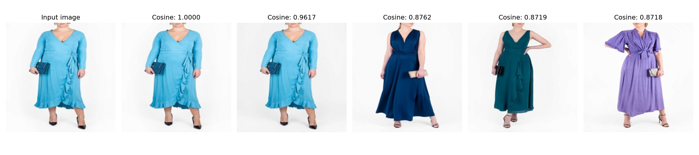

# Fashion Image Recommender

> AI-powered visual product recommendation system using pretrained ResNet-50 embeddings and cosine similarity

## Overview

This app is a fashion image recommendation app  lets a user upload an image and receive the five most visually similar products from the items we have in our store. The system uses a pretrained ResNet-50 model from TorchVision to extract fixed-length feature embeddings, removes invalid or duplicate images during preprocessing, and ranks the images using cosine similarity. The full workflow is served through a lightweight Flask application with a web interface.

A reproducible example output has been generated and stored as [model_output_sample.png](model_output_sample.png). The sample shows the uploaded query image alongside the top five recommended fashion products and their cosine similarity scores.

## 🚀 Project Summary

The pipeline begins with image cleaning and normalization, then builds a dataset of feature embeddings from the cleaned image set. The recommendation step compares the uploaded query embedding against all saved embeddings and selects the highest-scoring candidates (knn)   .

Key capabilities:

- Image validation and duplicate removal using Pillow and MD5 hashing
- Image normalization to a consistent 224 × 224 format
- Pretrained ResNet-50 embedding extraction with a frozen encoder
- Cosine similarity ranking for nearest-neighbor retrieval
- Flask-based interactive inference web app

## 📁 Repository structure

- `app.py` — Flask application entry point for the web interface and image recommendation workflow.
- `templates/index.html` — Browser UI for uploading an image and displaying recommendations.
- `src/cleanings.py` — Image validation, duplicate detection, and normalization pipeline.
- `src/transform.py` — ResNet-50 model loader and embedding extraction logic.
- `src/similarity.py` — Cosine similarity scoring and top-N recommendation selection .
- `src/recommender.py` — End-to-end recommendation orchestration using query embedding and saved dataset embeddings.
- `src/training.py` —  builds and saves image embeddings for an entire dataset.
- `src/eval.py` — evaluate our app output and save the 5 recommended  images and the cosine similarity as image in out folder output.
- `data/images/` — Raw source images .
- `data/clean_images/` — Deduplicated and standardized images used for retrieval.
- `data/embeddings/` — Saved embedding matrix and image path list used during inference.
- `app/static/uploads/` — Uploaded query images from the web app .
- `app/static/recommendations/` — the recommendation images that have been shown to our customer (monitoring our app output) .
- `output/` —  images of of the output of our eval.py
## 🧠 Technical details

- Language: Python 3 , HTML , CSS 
- Core libraries: `torch`, `torchvision`, `Pillow`, `numpy`, `matplotlib`, `Flask`, `pickle`, `pathlib` , `html`,`pathlib`

### Data preprocessing

The preprocessing pipeline validates each input image, removes corrupted files, hashes the image contents, and drop duplicate images. Every  image is then resized and converted to a fixed 224 × 224 RGB format for consistency.

### Model architecture

The system uses a pretrained `ResNet-50`  from TorchVision, with the final classification layer replaced by an identity mapping. This allows the network to act as a visual feature extractor and produce a embedding vector for each image.

### Retrieval strategy

Once the query image is encoded into an embedding vector, the application compares it against the saved embeddings from the database. The similarity is computed using cosine similarity, and the top five best matches are returned with their cosine similarity scores.

### Pipeline summary

- Load the pretrained ResNet-50 encoder and the final classification layers 
- Extract embeddings for each cleaned catalog image
- Save embeddings and image paths
- Upload a query image from the browser (our customer input )
- Encode the query image and compare it to all images we have in our database using cosine similarity
- Return the top five visually similar images

## Example output


 the model have recommeded us 5 image 
1. first image have 100% cosine similarity that mean we got the same item in our store 
2. second image have 0.98 cosine similarity
3. image 3 has 0.87 cosine similarity
4. image 4 has 0.87 cosine similarity
5. image 5 has 0.87 cosine similarity
 

## Installation

### 1. Create and activate a virtual environment

```bash
python -m venv .venv
.\.venv\Scripts\activate
```

### 2. Install dependencies

```bash
pip install requirments.txt
```
## 3. cleaning our dataset 

### clean our dataset and save our clean dataset

```bash
python src/cleanings.py
```

This step creates the cleaned image  and saves  under `data/clean_images/`.
## 4. function for load model and extract embedding 
```bash
python src/transform.py
```
## 5. cosine similarity and top 5 recommendation function
```bash
python src/similarity.py
```
## 6. loading embedding and retrival function
```bash
python src/recommender.py
```

## Run the project

### . Generate  embeddings to all our dataset

```bash
python src/train.py
```

This step saves the precomputed embeddings under `data/embeddings/`.

### 2. evaluate our model

```bash
python src/eval.py
```

This generates a reference visualization that compares the query image with the top five retrieved recommendations.

### 3. Launch the local web app

```bash
python app.py
```

Then open the browser at `http://127.0.0.1:5000/` and upload an image to receive visually similar fashion recommendations.

## Limitations

The current prototype relies on a frozen pretrained convolutional network rather than a domain-specific fine-tuned vision model, which keeps the method simple and fast but may miss subtle appearance differences that are important for fashion recommendation. 
## future improvements
Future work could include a domain-adapted encoder, more robust duplicate filtering, and a larger dataset product catalog for better retrieval quality and evaluation.
